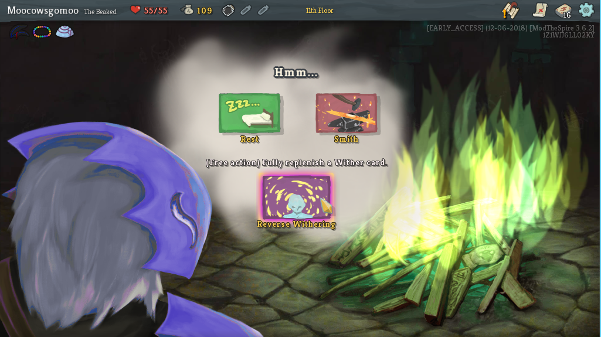

# BeakedTheCultist-StS
Adds a new character for Slay The Spire, complete with 75 new cards, 4 new relics, and a new Act 2 boss. More content is being added continuously!

The Beaked was blessed by the cult of the Awakened One, then cursed for stealing sacred knowledge. This cultist relies on healing and familiar techniques to power through, resorting to potent but hard to replicate spells.

[List of cards, relics, and other content](https://fiiiiilth.github.io/beaked/cardlist.html)

## New Keyword: Wither ##
Wither cards have extremely powerful effects, but each time you play one, it gets weaker for the rest of the run.
When a Wither card runs out of power completely, it becomes Depleted and unplayable.
Use your relics, cards, and a new campfire action to combat the darkness...or embrace it!

## Requirements ##

#### General Use ####
* Java 8 (JRE). Currently only Java 8 should be used, issues with Java 9 are being looked into.
* BaseMod v.2.10.0+ (https://github.com/daviscook477/BaseMod/releases)
* ModTheSpire v2.6.0+ (https://github.com/kiooeht/ModTheSpire/releases)

## Installation ##
1. If you have `ModTheSpire` already installed you can skip to step 5. Otherwise continue with step 2:
2. Download `ModTheSpire.jar` from the latest release (https://github.com/kiooeht/ModTheSpire/releases)
3. Move `ModTheSpire.jar` into your **Slay The Spire** directory. This directory is likely to be found under `C:\Program Files (x86)\Steam\steamapps\common\SlayTheSpire`. Place `ModTheSpire.jar` in that directory so it looks like `C:\Program Files (x86)\Steam\steamapps\common\SlayTheSpire\ModTheSpire.jar`
4. Create a `mods` folder in your **Slay The Spire** directory so it looks like `C:\Program Files (x86)\Steam\steamapps\common\SlayTheSpire\mods`
5. Download `BaseMod.jar` from the latest release (https://github.com/daviscook477/BaseMod/releases)
6. Move `BaseMod.jar` into the `mods` folder you created in step 4
7. Download `BeakedTheCultist.jar` from the latest release (https://github.com/fiiiiilth/BeakedTheCultist-StS/releases)
8. Move `BeakedTheCultist.jar` into the `mods` folder you created in step 4
9. Your modded version of **Slay The Spire** can now be launched by double-clicking on `ModTheSpire.jar`
10. This will open a mod select menu where you need to make sure that both `BaseMod` and `Beaked the Cultist` are checked before clicking **play**

Here is a great video showing how to install mods, by Xterminator: https://www.youtube.com/watch?v=r2m2aL1eEjw

## Special Thanks ##
1. Thanks to the [devs](https://www.megacrit.com/) of **SlayTheSpire** for making such and awesome game, allowing us to mod it, and allowing us to use recolored versions of their art assets in our mod
2. Thanks to t-larson and contributors (https://github.com/t-larson) for BaseMod!!
3. Thanks to kiooeht and contributors (https://github.com/kiooeht) for ModTheSpire!!
4. Thanks to everyone in the Discord community who's played the mod and given feedback!

## Other Mods ##
There are lots of fantastic mods that already exist for Slay the Spire. An updated list can be found at:
* https://github.com/kiooeht/ModTheSpire/wiki/List-of-Known-Mods
